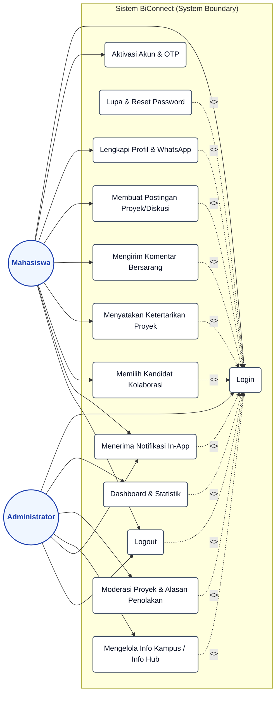

# Use Case Diagram — BiConnect

Berikut adalah kode **Mermaid.js** yang telah diperbarui untuk merender Use Case Diagram sistem BiConnect. Diagram ini sekarang mencakup fungsi **Login**, **Logout**, **Lupa & Reset Password**, serta menggunakan relasi **`<<include>>`** dan **`<<extend>>`** sesuai dengan standar UML untuk menggambarkan ketergantungan antar use case di program Anda.

## Kode Mermaid

---

## Penjelasan Relasi UML:

1. **`<<include>>` (Penyertaan)**:
   Digambarkan dengan garis putus-putus berpanah (`-.->`) dari use case asal ke use case `Login`. Artinya, pengguna **harus masuk (Login) terlebih dahulu** agar dapat menjalankan aksi-aksi tersebut (misal: membuat postingan, mengubah profil, atau melihat dashboard admin).
   
2. **`<<extend>>` (Perluasan)**:
   Digambarkan dengan garis putus-putus berpanah dari `Lupa & Reset Password` ke `Login`. Artinya, fitur lupa password bersifat **opsional/alternatif** yang dipicu hanya jika pengguna mengalami kendala saat melakukan proses `Login`.

3. **Login & Logout**:
   Kedua aktor (Mahasiswa & Admin) terhubung langsung ke use case `Login` dan `Logout` sebagai syarat utama masuk dan keluar dari hak akses sistem masing-masing.
